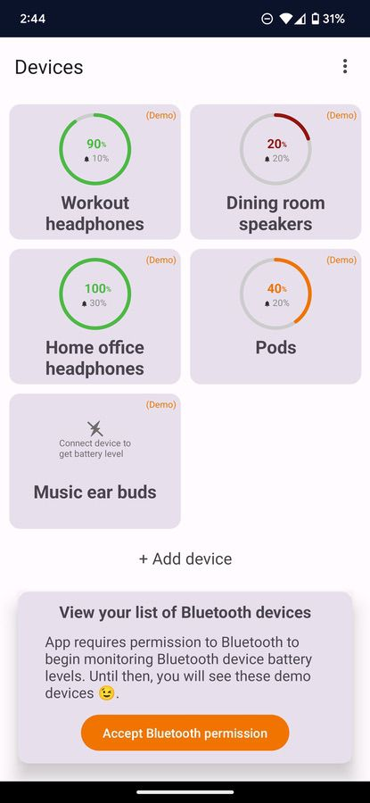

  

# BatteryBird 

Never forget to charge your devices again with Battery Bird. Available [on Google Play](https://play.google.com/store/apps/details?id=earth.levi.bluetoothbattery) 😄

> [!NOTE]
> I personally do not us this app anymore so I am not currently investing the time to make improvements to it. 

# Features 

### View the battery level of all your bluetooth devices 

> Quickly see all of the battery levels of your bluetooth devices.

### Get notified when it's time to charge 

> When the battery level of a device is low, get a notification as a helpful reminder to charge. 

### Import all of your bluetooth devices

Devices that you have added to your Android device in the Settings app can be imported to quickly begin monitoring battery levels. 

> After you accept bluetooth permission, the app will instantly show you all of the bluetooth devices added to your Android device. If any of those devices are currently connected to your device, the battery level will be shown in the app. 

> Before you accept bluetooth permission, the app runs in a Demo mode to let you try the app before giving it permission. 

### Add other bluetooth devices 

Add new bluetooth devices that are not registered to your Android device yet. Feature works great for some devices like smart watches that connect with their own proprietary app. 

> The way to add new bluetooth devices is with a MAC address of the device. 

> No worries if you don't know what a bluetooth MAC address is. I hope this message helps 😄

### Rename devices 

Bluetooth devices come with a name that was created by the manufacturer. Sometimes this name is not helpful and it's best to rename it to something you will more easily remember. 

> What is the Esinkin BT Adapter you might ask? It's my speakers in my upstairs office. I think "Office speakers" is a better name 😉

# Tech stack 

* **Jetpack Compose** to create the app's UI 
* **Kotlin Coroutines** to observe changes in the data of the app 
* **fastlane** to build and ship the app to Google Play from **GitHub Actions**
* **Kotlin Multiplatform Mobile (KMM)** to implement the app's data store. Created to re-use the logic on other platforms such as iOS if I ever decided to build an iOS or macOS version of this app. 

